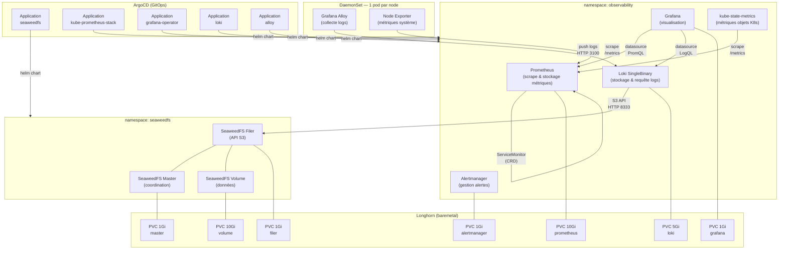

# Stack Observabilité Homelab — Documentation

## Contexte

Déploiement d'une stack d'observabilité complète sur un cluster Kubernetes baremetal de 3 nodes (homelab), avec pour objectifs :

- Monitorer les métriques système et applicatives
- Centraliser et explorer les logs
- Tout déployer via GitOps (ArgoCD + Helm)
- Se former sur des technologies proches du monde enterprise

---

## Architecture générale



---

## Composants et choix technologiques

### SeaweedFS — Stockage objet S3

**Rôle** : fournir une API S3 compatible en interne au cluster pour que Loki puisse stocker ses chunks de logs.

**Pourquoi SeaweedFS et pas MinIO ?** MinIO est sous licence AGPL v3 depuis 2021. Cette licence oblige à open-sourcer tout code qui interagit avec le service via le réseau — problématique en contexte enterprise. SeaweedFS est sous licence Apache 2.0, sans contraintes commerciales.

**Architecture déployée** : 3 pods séparés pour comprendre le rôle de chacun.

|Pod|Rôle|PVC|
|---|---|---|
|`seaweedfs-master`|Coordination, placement des données|1 Gi|
|`seaweedfs-volume`|Stockage brut des chunks|10 Gi|
|`seaweedfs-filer`|API S3, métadonnées (LevelDB)|1 Gi|

**Buckets créés automatiquement** : `chunks`, `ruler`, `admin` (les 3 requis par Loki).

**Authentification** : credentials S3 gérés via External Secrets Operator + OpenBao (KV v2), répliqués dans le namespace `observability` via kubernetes-replicator.

---

### kube-prometheus-stack — Métriques

**Rôle** : collecter, stocker et alerter sur les métriques du cluster et des workloads.

**Pourquoi ce chart ?** C'est le chart de référence de la communauté Prometheus. Il installe en une seule fois Prometheus, Alertmanager, Node Exporter, kube-state-metrics, et des dizaines de dashboards et règles d'alerte préconfigurés pour Kubernetes.

**Pattern CRD — ServiceMonitor** : plutôt que de configurer Prometheus à la main, chaque application dépose un `ServiceMonitor` dans son namespace. Prometheus les découvre automatiquement. C'est le pattern GitOps standard en enterprise.

```yaml
# Exemple : ajouter le monitoring d'une nouvelle app
apiVersion: monitoring.coreos.com/v1
kind: ServiceMonitor
metadata:
  name: mon-app
  namespace: mon-namespace
spec:
  selector:
    matchLabels:
      app: mon-app
  endpoints:
    - port: metrics
```

**Configuration notable** :

- Grafana **désactivé** dans ce chart — géré séparément par le Grafana Operator
- `serviceMonitorSelector: {}` — Prometheus découvre les ServiceMonitors dans **tous** les namespaces
- Rétention : 15 jours, PVC 10 Gi sur Longhorn
- Admission webhooks via cert-manager (renouvellement automatique des certificats)

---

### Grafana Operator — Visualisation

**Rôle** : déployer et configurer Grafana de façon déclarative via des CRDs Kubernetes.

**Pourquoi l'Operator plutôt que le chart intégré ?** Le Grafana Operator expose des CRDs (`GrafanaInstance`, `GrafanaDatasource`, `GrafanaDashboard`) qui permettent de gérer Grafana comme n'importe quelle ressource Kubernetes. Datasources et dashboards sont versionnés dans Git, réconciliés en continu.

```
GrafanaInstance      → le Pod Grafana
GrafanaDatasource    → Prometheus, Loki
GrafanaDashboard     → dashboards importés depuis grafana.com
```

**Datasources configurées** :

- Prometheus : `http://kube-prometheus-stack-prometheus.observability.svc:9090`
- Loki : `http://loki.observability.svc:3100`

**Dashboards importés** (via URL grafana.com) :

- Node Exporter Full (ID: 1860)
- Kubernetes Compute Resources Cluster (ID: 7249)
- Kubernetes Compute Resources Namespace (ID: 7250)
- Kubernetes Compute Resources Pod (ID: 6417)
- Alertmanager (ID: 9578)
- Loki Logs (ID: 13639)

---

### Loki — Agrégation de logs

**Rôle** : recevoir, indexer et rendre requêtables les logs du cluster.

**Mode SingleBinary** : tous les composants Loki (ingester, querier, distributor, compactor...) tournent dans un seul pod. C'est le mode recommandé pour les petits clusters — moins de ressources qu'un déploiement SimpleScalable ou Distributed.

**Backend S3** : les chunks de logs sont stockés dans SeaweedFS via l'API S3. Loki ne stocke localement que le WAL (Write-Ahead Log) et le cache TSDB (5 Gi sur Longhorn).

**Configuration critique pour SingleBinary 1 replica** : sans ces 3 paramètres, Loki démarre mais refuse les écritures car il attend un quorum impossible à atteindre avec 1 seul pod.

```yaml
loki:
  replication_factor: 1          # niveau racine
  common:
    replication_factor: 1        # niveau common
  ingester:
    lifecycler:
      ring:
        kvstore:
          store: inmemory        # ring local, pas de gossip externe
        replication_factor: 1
```

**Rétention** : 30 jours, gérée par le compactor intégré.

**Schéma de stockage** : TSDB v13 (format recommandé en Loki v3+).

---

### Grafana Alloy — Collecte des logs

**Rôle** : DaemonSet sur chaque node qui collecte les logs et les envoie vers Loki.

**Pourquoi Alloy et pas Promtail ?** Promtail est officiellement en maintenance mode depuis 2024. Grafana Alloy est son successeur — il supporte nativement les pipelines OpenTelemetry et la config River (déclarative, lisible).

**Sources collectées** :

- **Logs containers** : lecture de `/var/log/pods/` sur chaque node via `loki.source.kubernetes`
- **Logs système** : lecture de `/var/log/journal` via `loki.source.journal` (journald/systemd)

**Labels Loki générés automatiquement** : `namespace`, `pod`, `container`, `app`, `node`, `source`

**Config River** : langage déclaratif d'Alloy, organisé en composants chaînés.

```
discovery.kubernetes → discovery.relabel → loki.source.kubernetes → loki.process → loki.write
loki.source.journal → loki.process → loki.write
```

**Debug** : l'UI Alloy est accessible via port-forward sur le port 12345.

```bash
kubectl port-forward -n observability daemonset/alloy 12345:12345
```

---

## Infrastructure transverse

### GitOps — ArgoCD

Chaque composant est déployé via une `Application` ArgoCD pointant vers un chart Helm et un `values.yaml` dans un mono-repo Git. ArgoCD réconcilie en continu l'état du cluster avec le repo.

**Structure du repo** :

```
apps/
├── seaweedfs/
│   ├── application.yaml
│   ├── values.yaml
│   └── externalsecret.yaml
├── kube-prometheus-stack/
│   ├── application.yaml
│   └── values.yaml
├── grafana-operator/
│   ├── application.yaml
│   ├── values.yaml
│   ├── grafana-instance.yaml
│   └── grafana-dashboards.yaml
├── loki/
│   ├── application.yaml
│   └── values.yaml
└── alloy/
    ├── application.yaml
    └── values.yaml
```

### Gestion des secrets — OpenBao + External Secrets

Les credentials (S3, Grafana admin) sont stockés dans OpenBao (fork libre de HashiCorp Vault, KV v2). External Secrets Operator les synchronise dans des Secrets Kubernetes. kubernetes-replicator propage les secrets entre namespaces.

```
OpenBao (KV v2)
    │
    │ ExternalSecret
    ▼
Secret K8s (namespace: seaweedfs)
    │
    │ kubernetes-replicator
    ▼
Secret K8s (namespace: observability)
```

### Stockage persistant — Longhorn

Longhorn fournit la StorageClass pour tous les PVCs. Configuration retenue : 1 replica par PVC (homelab, backup externe prévu). Longhorn supporte le resize à chaud des PVCs.

---

## Ordre de déploiement

L'ordre est important car certains composants dépendent des autres au démarrage.

```
1. SeaweedFS         (les buckets S3 doivent exister avant Loki)
2. kube-prometheus-stack
3. Grafana Operator  (installe les CRDs avant de déployer l'instance)
4. Loki              (SeaweedFS doit être up)
5. Grafana Alloy     (Loki doit être up pour recevoir les logs)
```

---

## Ressources consommées (estimé)

|Composant|Pods|RAM|CPU|
|---|---|---|---|
|SeaweedFS|3|~300 Mo|faible|
|Prometheus|1|~500 Mo|moyen|
|Alertmanager|1|~64 Mo|faible|
|Node Exporter|3 (DS)|~150 Mo|faible|
|kube-state-metrics|1|~128 Mo|faible|
|Prometheus Operator|1|~128 Mo|faible|
|Grafana|1|~256 Mo|faible|
|Grafana Operator|1|~128 Mo|faible|
|Loki|1|~512 Mo|faible|
|Grafana Alloy|3 (DS)|~192 Mo|faible|
|**Total**|**~16**|**~2,4 Go**||

---

## Problèmes rencontrés

### SeaweedFS

**Mauvaise clé dans le Secret S3 (`config.json` vs `seaweedfs_s3_config`)** Le chart v4.17.0 attend une clé nommée exactement `seaweedfs_s3_config` dans le Secret monté par le filer. Les exemples et anciennes documentations utilisent `config.json`. L'erreur est silencieuse — le filer démarre mais l'auth S3 est ignorée.

**Tirets dans les noms de clés du template External Secrets** Les templates External Secrets utilisent le moteur de templates Go. Les tirets dans les noms de variables (`loki-accessKey`) sont interprétés comme des opérateurs de soustraction, ce qui provoque une erreur `bad character U+002D '-'`. Solution : utiliser des underscores (`loki_accessKey`).

**Erreur `map has no entry for key`** Après correction des tirets, une incohérence entre les noms de clés dans la section `data` de l'ExternalSecret et les variables utilisées dans le template provoquait cette erreur. Les noms dans `data[].secretKey` doivent correspondre exactement aux variables `{{ .nomDeClé }}` dans le template.

**Buckets Loki incomplets** Initialement un seul bucket `loki` avait été créé. Loki en mode SingleBinary requiert 3 buckets distincts : `chunks` (données), `ruler` (règles d'alerte) et `admin` (métadonnées). Loki refuse de démarrer si l'un d'eux est manquant.

---

### kube-prometheus-stack

**`MountVolume.SetUp failed` — secret TLS admission introuvable** En désactivant les admission webhooks avec seulement `admissionWebhooks.enabled: false`, le chart tentait quand même de monter un Secret TLS `kube-prometheus-stack-admission` qui n'existait pas. Il faut désactiver explicitement les deux sous-composants :

```yaml
admissionWebhooks:
  enabled: false
  patch:
    enabled: false   # désactive le Job de création du secret
  certManager:
    enabled: false
```

Solution finale retenue : activer les webhooks avec cert-manager (`certManager.enabled: true`), ce qui est le pattern propre quand cert-manager est déjà installé.

---

### Grafana Operator

**`no instance found` pour les datasources et dashboards** L'opérateur cherche les instances Grafana via leurs `metadata.labels`, pas via les labels des Pods. Le label `dashboards: grafana` doit être sur l'objet CRD `Grafana` lui-même, pas dans `spec.deployment.template.metadata.labels`. Ces deux endroits sont indépendants — l'un est sur la ressource Kubernetes, l'autre sur les Pods générés.

```bash
# Correction rapide
kubectl label grafana -n observability grafana dashboards=grafana
```

**`failed to authenticate with grafana`** L'opérateur crée son propre Secret `grafana-admin-credentials` avec des credentials auto-générés. Quand on remplace le mot de passe admin via un Secret externe, l'opérateur continue d'utiliser ses credentials d'origine qui ne correspondent plus. Il faut configurer les credentials admin directement dans `spec.config.security` du CRD `Grafana` en référençant les variables d'environnement depuis le Secret, pour que l'opérateur et Grafana soient toujours synchronisés.

---

### Loki

**Credentials S3 non résolus (`InvalidAccessKeyId`)** La substitution de variables `${VAR}` dans la config `loki.storage.s3` n'est pas supportée de façon fiable par le chart Loki v6. Plusieurs approches ont été testées avant de trouver la solution fonctionnelle : utiliser les variables d'environnement standard du SDK AWS (`AWS_ACCESS_KEY_ID`, `AWS_SECRET_ACCESS_KEY`) injectées via `extraEnv` dans le pod, que le SDK Go d'AWS lit automatiquement.

**SDK AWS ignorant les env vars → fallback EC2 IMDS** Quand les variables d'environnement ne sont pas correctement injectées, le SDK AWS tente de trouver des credentials via le service de métadonnées EC2 (`169.254.169.254`), qui n'existe pas sur du baremetal. Le pod restait bloqué en timeout. La cause racine était que le Secret répliqué par kubernetes-replicator n'était pas encore disponible au moment du démarrage du pod.

**`too many unhealthy instances in the ring`** L'API Loki retournait une erreur 500 sur tous les endpoints malgré un pod `Ready`. Le ring de memberlist attendait plusieurs membres alors qu'un seul pod tourne. Fix : passer le KV store en `inmemory` pour chaque composant interne.

```yaml
ingester:
  lifecycler:
    ring:
      kvstore:
        store: inmemory
      replication_factor: 1
```

**`at least 2 live replicas required`** Même après avoir configuré `common.replication_factor: 1` et les rings en `inmemory`, Loki refusait les écritures avec cette erreur. Le distributor utilisait une valeur interne par défaut de 3 pour calculer le quorum d'écriture (floor(3/2)+1 = 2). Fix : setter `replication_factor: 1` au niveau racine du bloc `loki:` dans les values, en plus des autres niveaux.

**Composants non désactivés (canary, caches memcached)** Le chart Loki v6 déploie par défaut `loki-canary` (DaemonSet de test) et deux StatefulSets de cache memcached (`loki-chunks-cache`, `loki-results-cache`). Ces composants ne sont pas utiles en SingleBinary homelab et consomment des ressources. Ils doivent être explicitement désactivés dans les values :

```yaml
lokiCanary:
  enabled: false
chunksCache:
  enabled: false
resultsCache:
  enabled: false
```

---

### Grafana Alloy

**Values incompatibles entre versions du chart (0.12.x → 1.6.2)** La structure des values a changé entre les versions. Les points de rupture principaux :

- `controller.volumeMounts.extra` n'existe plus → remplacé par `alloy.mounts.extra`
- `alloy.mounts.varlog: true` monte directement `/var/log` depuis le node, couvrant à la fois `/var/log/pods` et `/var/log/journal` en un seul mount
- `serviceMonitor.additionalLabels` reste inchangé

---

## Évolutions possibles

- **Tempo** : ajouter le tracing distribué pour compléter le stack LGTM (Loki + Grafana + Tempo + Mimir)
- **Mimir** : remplacer Prometheus par Mimir pour un stockage long terme des métriques (backend S3 également)
- **Loki SimpleScalable** : si le volume de logs augmente, migrer vers le mode 3 pods (write/read/backend) sans changer le backend S3
- **SeaweedFS réplication** : augmenter le `replicationPlacement` de `000` à `001` si un second volume server est ajouté
- **Alertmanager receivers** : configurer des notifications Slack ou mail dans l'`alertmanager.config` du chart
## Loki

J'ai décidé d'utiliser SingleBinary comme je suis sur un petit cluster.

### Erreur Credentials S3

https://github.com/grafana/loki/issues/12218
J'avais les erreurs suivantes :
```
level=error ts=2026-03-28T21:58:59.159541109Z caller=log.go:223 msg="error running loki" err="init compactor: failed to init delete store: failed to get s3 object: op │
│ eration error S3: GetObject, https response error StatusCode: 403, RequestID: 18A12034C2CB30C1EBCE05BA, HostID: , api error InvalidAccessKeyId: The access key ID you  │
│ provided does not exist in our records.\nerror initialising module: compactor\ngithub.com/grafana/dskit/modules.(*Manager).initModule\n\t/src/loki/vendor/github.com/g │
│ rafana/dskit/modules/modules.go:138\ngithub.com/grafana/dskit/modules.(*Manager).InitModuleServices\n\t/src/loki/vendor/github.com/grafana/dskit/modules/modules.go:10 │
│ 8\ngithub.com/grafana/loki/v3/pkg/loki.(*Loki).Run\n\t/src/loki/pkg/loki/loki.go:549\nmain.main\n\t/src/loki/cmd/loki/main.go:136\nruntime.main\n\t/usr/local/go/src/r │
│ untime/proc.go:283\nruntime.goexit\n\t/usr/local/go/src/runtime/asm_amd64.s:1700" 
```

Il fallait en fait rajouter `extraArgs` dans la conf :
```yaml
storage:
	type: s3
	s3:
	  endpoint: endpoint
	  region: us-east-1
	  secretAccessKey: "${S3_SECRET_ACCESS_KEY}"
	  accessKeyId: "${S3_ACCESS_KEY_ID}"
	  s3ForcePathStyle: true
	  insecure: true
singleBinary:
          replicas: 1
		  extraArgs:
		  - -config.expand-env=true
          extraEnv:
            - name: S3_ACCESS_KEY_ID
              valueFrom:
                secretKeyRef:
                  name: seaweedfs-s3-loki-credentials
                  key: S3_ACCESS_KEY_ID
            - name: S3_SECRET_ACCESS_KEY
              valueFrom:
                secretKeyRef:
                  name: seaweedfs-s3-loki-credentials
                  key: S3_SECRET_ACCESS_KEY
```

Et le pod tourne !


### Loki erreur ecriture

```
03-28T23:09:33.553805967Z caller=manager.go:49 component=distributor path=write msg="write operation failed" details="entry for stream '{container │
│ level=error ts=2026-03-28T23:09:33.619102745Z caller=manager.go:49 component=distributor path=write msg="write operation failed" details="entry for stream '{container │
│ level=warn ts=2026-03-28T23:09:33.743833352Z caller=logging.go:144 orgID=fake msg="POST /loki/api/v1/push (500) 269.662597ms Response: \"at least 2 live replicas requ │
│ level=info ts=2026-03-28T23:09:43.657087612Z caller=table_manager
```

Pour résoudre ça, il faut : 
```yaml
loki:                                                                                     commonConfig:                                                                             replication_factor: 1
```